<p align="center">
  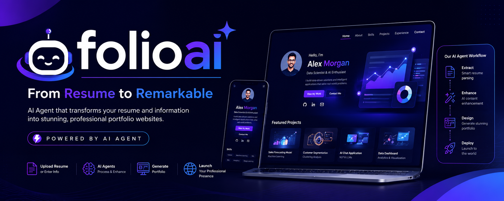
</p>

<h1 align="center"> FolioAI</h1>

<p align="center">
Transform Your Resume into a Professional Portfolio Website with AI Agents
</p>

## Tech Stack

| Category | Technology |
|----------|------------|
| Frontend | Next.js 15 |
| Language | TypeScript |
| Styling | Tailwind CSS |
| AI Model | Gemini |
| Agent Framework | Google ADK |
| Protocol | MCP |
| AI Development | Antigravity |

---

## Overview

**FolioAI** is an AI-powered **multi-agent portfolio generation platform** that transforms resumes into beautiful, responsive, and production-ready portfolio websites.

Instead of relying on a single AI prompt, FolioAI orchestrates multiple specialized AI agents that collaborate to analyze resumes, enhance content, design personalized portfolios, and prepare them for deployment.

Built using **Google Agent Development Kit (ADK)**, **Gemini**, **Model Context Protocol (MCP)**, **Next.js**, and **Tailwind CSS**, FolioAI demonstrates how intelligent agent collaboration can automate professional portfolio creation.

---

## Key Highlights

- Multi-Agent Architecture
- AI Resume Parsing
- AI Content Enhancement
- Intelligent Portfolio Design
- AI Thinking Panel
- Mission Control Dashboard
- AI Generation Report
- Fully Responsive
- Modern SaaS UI
- Secure Processing

---

# Problem Statement

Building a professional portfolio website is one of the biggest challenges for students, developers, and job seekers.

Many individuals have excellent resumes but lack the technical skills, design knowledge, or time required to create an attractive personal portfolio. Existing website builders often require manual customization, repetitive content formatting, and design decisions that can be overwhelming for non-technical users.

As a result, many talented candidates struggle to present their skills effectively to recruiters and employers.

---

# Our Solution

**FolioAI** solves this problem by using a collaborative team of AI agents that automatically transform a resume into a modern, responsive, and production-ready portfolio website.

Instead of relying on a single AI prompt, FolioAI distributes responsibilities across specialized AI agents. Each agent performs a dedicated task—from extracting resume information to enhancing content, selecting an appropriate portfolio structure, generating the design, and preparing the final deployment.

This multi-agent workflow improves transparency, modularity, and scalability while giving users visibility into every step of the generation process through Mission Control, AI Thinking, and the AI Generation Report.

---

#  Why Multi-Agent AI?

Rather than asking one AI model to perform every task, FolioAI uses specialized agents that collaborate to complete the workflow.

This approach provides several advantages:

- Clear separation of responsibilities
- Better scalability
- Transparent decision making
- Easier maintenance and future expansion
- Improved user trust through visible agent activity
- Modular architecture for adding new agents

Each AI agent is responsible for one specific objective, making the system more organized and easier to improve over time.

---

# Real-World Impact

FolioAI enables students, graduates, freelancers, and professionals to quickly create high-quality portfolio websites without requiring web development or design expertise.

By automating the portfolio creation process, FolioAI helps users:

- Build a professional online presence
- Save hours of manual work
- Present their achievements effectively
- Increase confidence during job applications
- Share a responsive portfolio with recruiters in minutes

Our vision is to make professional portfolio creation accessible to everyone through intelligent AI agents.

---

# Features

FolioAI combines the power of AI agents with modern web technologies to automate portfolio creation from start to finish.

| Feature | Description |
|----------|-------------|
| Multi-Agent Architecture | Uses multiple specialized AI agents powered by Google ADK to collaboratively build a professional portfolio. |
| AI Resume Parsing | Automatically extracts personal information, education, experience, skills, certifications, and projects from uploaded resumes. |
| Manual Information Entry | Users can manually enter or edit their information if they don't have a resume. |
|  AI Content Enhancement | Improves grammar, readability, professionalism, and impact while preserving the user's original experience. |
| AI Thinking Panel | Displays real-time explanations of what each AI agent is doing, increasing transparency and user trust. |
| AI Mission Control | Live dashboard showing agent status, execution progress, timestamps, and workflow updates. |
| Intelligent Portfolio Generation | Automatically creates a clean, responsive, and modern portfolio website personalized to the user's profile. |
| Theme Recommendation | Selects the most suitable portfolio theme based on the user's skills and career background. |
| AI Generation Report | Provides a complete summary of each agent's work, execution time, quality metrics, and improvements made. |
| Responsive Design | Optimized for desktop, tablet, and mobile devices. |
| Secure Processing | API keys remain protected through secure backend integration and environment variables. |
| Deployment Ready | Generates a portfolio that can be deployed or shared with recruiters. |

---

# Key Highlights

### True Multi-Agent System

Unlike traditional AI applications that rely on a single prompt, FolioAI assigns specialized responsibilities to multiple AI agents that collaborate throughout the portfolio generation process.

---

### AI Mission Control

A real-time operations dashboard that visualizes the execution of every AI agent with live progress tracking, timestamps, and activity logs.

---

###  AI Thinking

Users can follow each agent's reasoning in simple language, making the AI process transparent, educational, and trustworthy.

---

### AI Generation Report

After generation, users receive a detailed report showing:

- Tasks completed by each AI agent
- Portfolio improvements
- Readability score
- SEO readiness
- Accessibility score
- Execution timeline
- Overall quality metrics

---

### Professional Portfolio Design

FolioAI automatically generates modern portfolio websites featuring:

- Responsive layouts
- Professional typography
- Project showcase
- Skills section
- Experience timeline
- Contact information
- About page
- Clean SaaS-inspired design

---

### Built for Performance

- Fast portfolio generation
- Responsive user interface
- Optimized loading states
- Smooth animations
- Accessible components
- Production-ready architecture

---

# Application Preview

> Screenshots of the application will be added below.

| Landing Page | Dashboard |
|--------------|-----------|
| 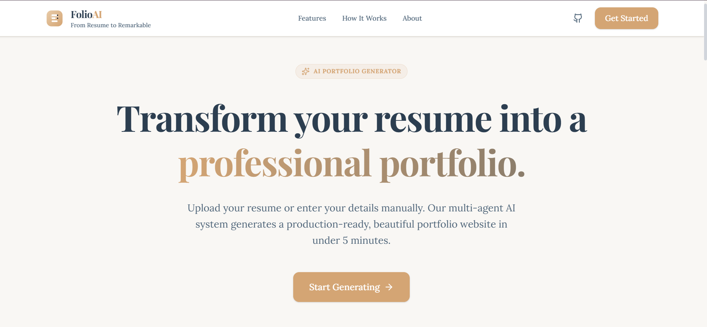 | 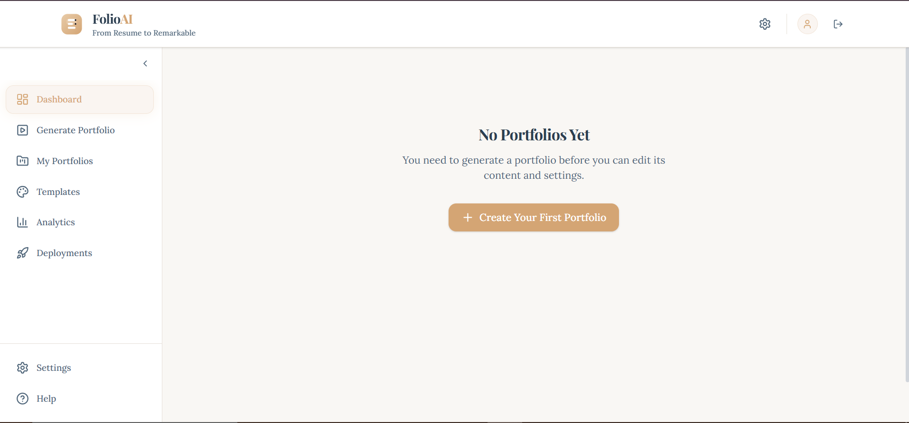 |

| Mission Control | AI Thinking |
|-----------------|-------------|
| 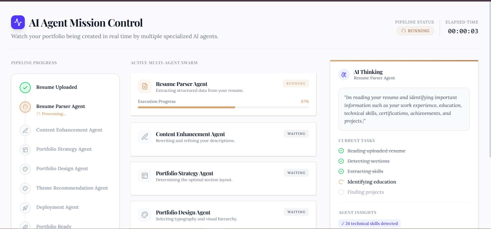 | 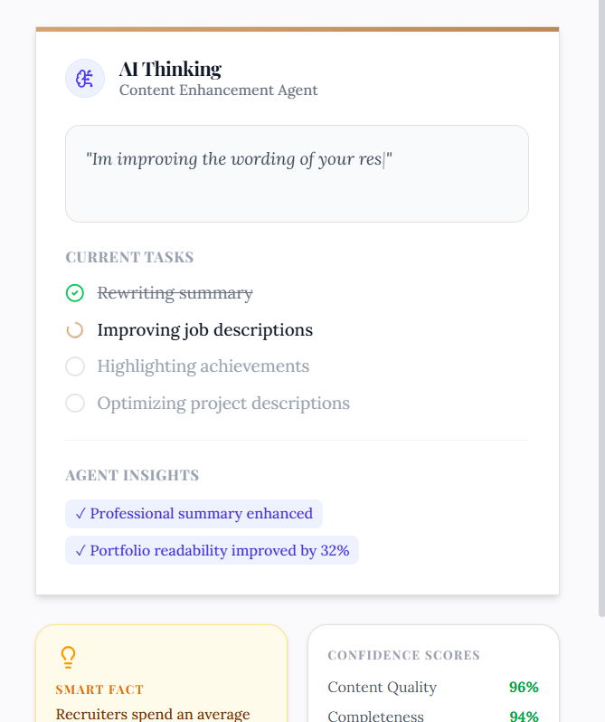 |

| AI Generation Report | Portfolio Preview |
|----------------------|-------------------|
| 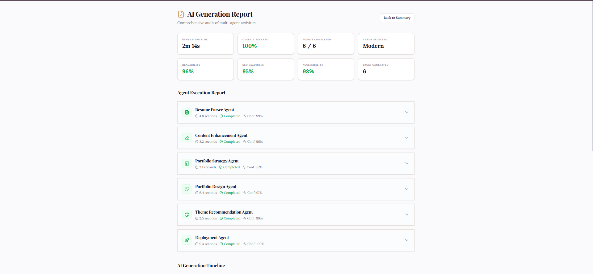 | 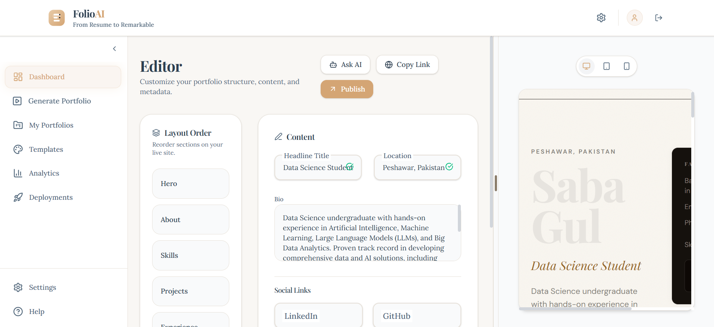 |

> **Note:** Replace the placeholder images with actual screenshots before submission.

---

# Multi-Agent Architecture

FolioAI is built around a collaborative multi-agent architecture powered by **Google Agent Development Kit (ADK)**. Instead of relying on a single AI model to complete every task, specialized AI agents work together under the supervision of an Agent Coordinator.

Each agent has a well-defined responsibility, making the system more modular, transparent, scalable, and easier to maintain.

---

## Agent Workflow

```text
                    User
                      │
                      ▼
          Upload Resume / Manual Entry
                      │
                      ▼
            Google ADK Coordinator
                      │
        ┌─────────────┼─────────────┐
        │             │             │
        ▼             ▼             ▼
 Resume Parser   Content Agent   Strategy Agent
        │             │             │
        └─────────────┼─────────────┘
                      ▼
              Portfolio Design Agent
                      │
                      ▼
          Theme Recommendation Agent
                      │
                      ▼
             Deployment Preparation Agent
                      │
                      ▼
            Professional Portfolio Website
```

---

# AI Agents

## Resume Parser Agent

### Responsibilities

- Extract personal information
- Identify work experience
- Detect education history
- Extract technical skills
- Identify certifications
- Parse projects
- Organize resume structure

**Output**

Structured candidate profile.

---

##  Content Enhancement Agent

### Responsibilities

- Improve grammar
- Rewrite descriptions
- Enhance professional language
- Improve readability
- Highlight achievements
- Optimize portfolio content

**Output**

Professional, recruiter-friendly content.

---

##  Portfolio Strategy Agent

### Responsibilities

- Organize portfolio sections
- Prioritize projects
- Recommend portfolio structure
- Determine content hierarchy
- Improve recruiter experience

**Output**

Optimized portfolio blueprint.

---

##  Portfolio Design Agent

### Responsibilities

- Generate responsive layouts
- Apply design system
- Build portfolio pages
- Optimize typography
- Create visual hierarchy

**Output**

Modern responsive portfolio website.

---

## Theme Recommendation Agent

### Responsibilities

- Analyze candidate profile
- Select best portfolio theme
- Match colors and layout
- Personalize appearance

**Output**

Professionally themed portfolio.

---

## Deployment Agent

### Responsibilities

- Prepare production build
- Optimize assets
- Generate metadata
- Prepare deployment package

**Output**

Deployment-ready portfolio.

---

# Agent Communication

FolioAI follows a sequential orchestration model where each AI agent receives structured output from the previous agent before performing its specialized task.

This architecture improves:

- Reliability
- Transparency
- Scalability
- Reusability
- Debugging
- Future extensibility

---

# Model Context Protocol (MCP)

FolioAI integrates the **Model Context Protocol (MCP)** to provide standardized communication between AI agents and external tools.

MCP enables agents to securely access resources, exchange structured information, and maintain consistent context throughout the portfolio generation workflow.

Benefits include:

- Standardized tool communication
- Modular integration
- Better interoperability
- Improved scalability
- Easier future integrations

---

# Google Agent Development Kit (ADK)

Google ADK acts as the orchestration layer for FolioAI.

It coordinates each specialized AI agent, manages task execution, tracks workflow progress, and ensures that every stage of the portfolio generation process executes in the correct order.

Using ADK allows FolioAI to:

- Coordinate multiple AI agents
- Manage execution pipelines
- Handle agent lifecycle
- Improve modularity
- Simplify future expansion

---

# Architecture Diagram

> The architecture diagram below illustrates the interaction between users, AI agents, Google ADK, MCP, Gemini, and the generated portfolio.

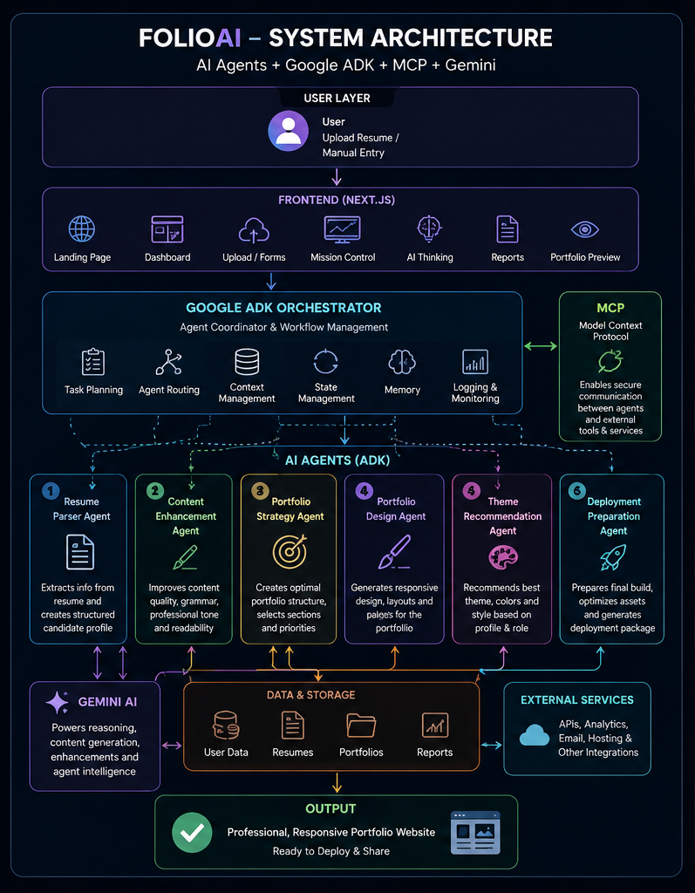

---

# Workflow Diagram

> Complete portfolio generation workflow.

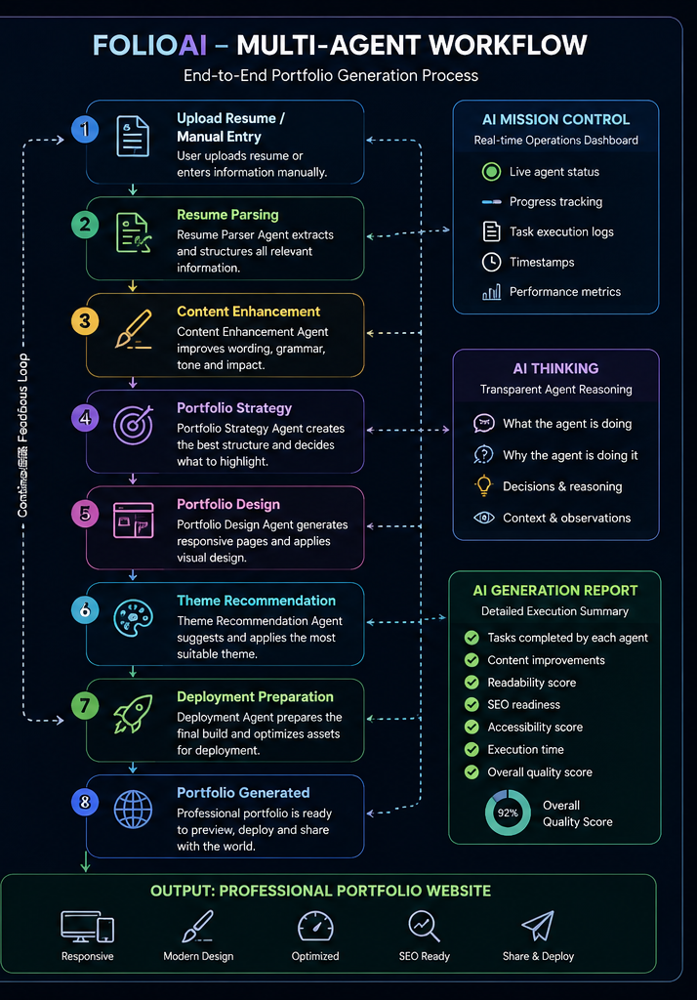
---

# Technology Stack

FolioAI is built using modern web technologies, Google's AI ecosystem, and a scalable multi-agent architecture.

| Category | Technology | Purpose |
|----------|------------|---------|
| Frontend | Next.js | React framework for building a fast, scalable, and production-ready web application |
| Language | TypeScript | Strongly typed JavaScript for better maintainability and developer experience |
| Styling | Tailwind CSS | Utility-first CSS framework for building a modern, responsive UI |
| AI Model | Gemini | Generates content, enhances resume information, and powers intelligent portfolio creation |
| Agent Framework | Google Agent Development Kit (ADK) | Coordinates and manages the execution of specialized AI agents |
| Agent Communication | Model Context Protocol (MCP) | Standardizes communication between AI agents and external tools |
| AI Development | Antigravity | Rapidly develops and refines AI agent workflows and application features |
| Version Control | Git & GitHub | Source code management and collaboration |
| Deployment | Vercel *(Recommended)* | Deploys the application with high performance and scalability |

---

# Core Technologies

## Next.js

Next.js provides server-side rendering, routing, optimized performance, and a scalable architecture for building production-ready web applications.

### Why Next.js?

- Fast page loading
- Optimized performance
- SEO-friendly
- Server-side rendering
- Production-ready architecture

---

## TypeScript

TypeScript improves code quality by adding static typing, reducing runtime errors, and making the project easier to maintain.

### Benefits

- Better code reliability
- Strong type safety
- Easier debugging
- Improved scalability

---

## Tailwind CSS

Tailwind CSS enables rapid development while maintaining a clean, consistent, and responsive design system.

### Benefits

- Utility-first styling
- Responsive layouts
- Reusable components
- Faster UI development

---

## Google Agent Development Kit (ADK)

Google ADK serves as the orchestration layer of FolioAI.

It manages the complete lifecycle of every AI agent, coordinates task execution, and ensures seamless collaboration between agents throughout the portfolio generation process.

### Used For

- Agent orchestration
- Workflow coordination
- Multi-agent execution
- Task management

---

## Gemini AI

Gemini powers the intelligence behind FolioAI.

It understands resume content, improves professional writing, generates structured portfolio content, and assists multiple AI agents throughout the workflow.

### Used For

- Resume understanding
- Content enhancement
- Professional writing
- Portfolio generation

---

## Model Context Protocol (MCP)

MCP provides a standardized method for AI agents to communicate with tools and services while maintaining structured context.

### Benefits

- Standardized communication
- Better interoperability
- Modular architecture
- Future extensibility

---

## Antigravity

Antigravity accelerated the development of FolioAI by enabling rapid iteration on user interfaces, workflows, and AI agent experiences.

It was used to prototype, refine, and polish the application's design while maintaining consistency across the platform.

---

# Development Tools

- Visual Studio Code
- Git
- GitHub
- npm
- Node.js

---

# Why This Stack?

Our technology stack was selected to deliver a modern, scalable, and production-ready AI application.

By combining Google's AI ecosystem with Next.js and Tailwind CSS, FolioAI achieves:

- High performance
- Modular architecture
- Responsive design
- Transparent AI workflows
- Easy future expansion
- Production-ready deployment

---

# Application Showcase

FolioAI is designed with a modern SaaS-inspired interface that combines powerful AI capabilities with an intuitive user experience. Every screen is crafted to provide transparency, simplicity, and a seamless workflow.

---

## Landing Page

The landing page introduces FolioAI, highlights its key capabilities, and guides users through the portfolio generation process.

<p align="center">
  
</p>

---

## Authentication

Users can securely sign in or create an account to access their personalized dashboard.

<p align="center">
  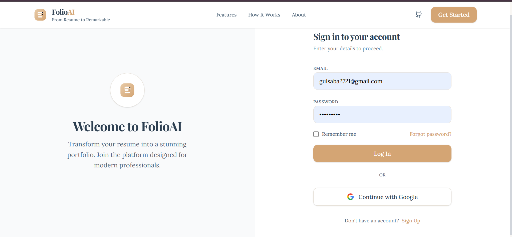
</p>

---

## Dashboard

The dashboard provides quick access to portfolio generation, previous projects, AI activity, and account settings.

<p align="center">
  
</p>

---

## Resume Upload

Users can upload a resume or manually enter their professional information before starting the AI workflow.

<p align="center">
  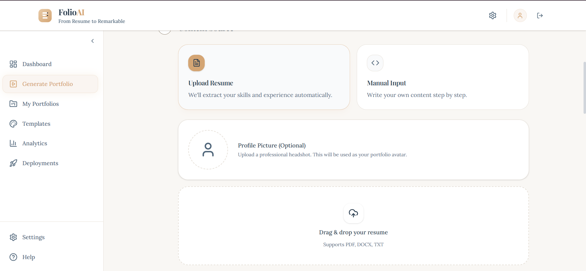
</p>

---

## AI Mission Control

Mission Control visualizes the execution of each AI agent with live progress tracking, timestamps, and workflow status.

<p align="center">
  
</p>

---

## AI Thinking Panel

The AI Thinking panel explains, in real time, what each AI agent is doing and why, improving transparency and user trust.

<p align="center">
  
</p>

---

## AI Generation Report

After portfolio generation, users receive a detailed report showing completed tasks, execution time, quality scores, and improvements made by each AI agent.

<p align="center">
  
</p>

---

## Portfolio Preview

Before deployment, users can preview the generated portfolio across different screen sizes.

<p align="center">
  
</p>

---

## Final Portfolio

The completed portfolio is fully responsive, professionally designed, and ready to share with recruiters or deploy online.

<p align="center">
  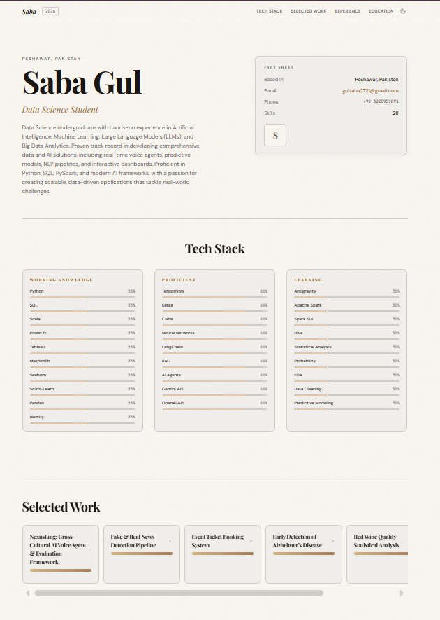
</p>

---

## Responsive Experience

FolioAI is optimized for:

- Desktop
- Laptop
- Mobile
- Tablet

Providing a consistent experience across all devices.

---

# Installation & Getting Started

Follow these steps to set up and run FolioAI on your local machine.

## Prerequisites

Before you begin, make sure you have the following installed:

- Node.js (v18 or later)
- npm or yarn
- Git
- A Google Gemini API Key
- Google ADK
- MCP Server (if applicable)

---

## Clone the Repository

```bash
git clone https://github.com/gulsaba-max/folioai.git

cd folioai
```

---

## Install Dependencies

Using npm:

```bash
npm install
```

Or using yarn:

```bash
yarn install
```

---

## Configure Environment Variables

Create a `.env.local` file in the project root and add your API keys:

```env
GOOGLE_API_KEY=your_google_api_key

GEMINI_API_KEY=your_gemini_api_key

NEXT_PUBLIC_APP_URL=http://localhost:3000
```

>  **Never commit your API keys to GitHub.**

---

## Run the Development Server

Using npm:

```bash
npm run dev
```

Or using yarn:

```bash
yarn dev
```

Open your browser and visit:

```
http://localhost:3000
```

---

## Build for Production

```bash
npm run build
```

Start the production server:

```bash
npm start
```

---

# Project Structure

```
folioai/
│
├── app/
├── components/
├── lib/
├── services/
├── public/
│
├── docs/
│   ├── architecture/
│   ├── diagrams/
│   ├── screenshots/
│   └── demo/
│
├── README.md
├── CONTRIBUTING.md
├── LICENSE
├── .env.example
├── package.json
└── tsconfig.json
```

---

# Testing the Application

1. Start the development server.
2. Open `http://localhost:3000`.
3. Sign in or create an account.
4. Upload your resume or enter your information manually.
5. Watch the AI Mission Control execute the multi-agent workflow.
6. Review the AI Thinking panel and Generation Report.
7. Preview and export your generated portfolio.

---

# Deployment

FolioAI can be deployed using platforms such as:

- ▲ Vercel
- Netlify
- Docker
- Self-hosted Node.js server

For the best experience, we recommend deploying with **Vercel**, which offers seamless integration with Next.js.

---

# Security Notes

To keep your application secure:

- Store API keys in environment variables.
- Never expose secrets in the frontend.
- Never commit `.env.local` to GitHub.
- Use HTTPS in production.
- Rotate API keys periodically.

---
---

# Team

FolioAI was developed as part of the **Google AI Agents Capstone Hackathon**.

## Team Name

**Neural Nexus**

## Team Members

| Name | Role |
|------|------|
| **Saba Gul** | AI Engineer • Full Stack Developer • Multi-Agent System Development |
| **Parkha Kashaf Zeb** | AI Engineer • UI/UX Design • Agent Workflow & Testing |

Together, we designed and developed FolioAI to demonstrate how collaborative AI agents can automate portfolio creation while providing transparency, scalability, and an exceptional user experience.

---

# Roadmap

We envision FolioAI becoming a complete AI-powered career platform.

### Completed

- Resume Upload
- Manual Information Entry
- Multi-Agent Workflow
- Google ADK Integration
- MCP Integration
- AI Mission Control
- AI Thinking Panel
- AI Generation Report
- Responsive Portfolio Generator
- Modern SaaS Interface

---

###  Coming Soon

- Portfolio Theme Marketplace
- AI Resume Builder
- AI Interview Preparation
- GitHub Repository Import
- LinkedIn Profile Import
- One-Click Portfolio Deployment
- Custom Domain Support
- Team Collaboration
- Portfolio Analytics Dashboard
- Recruiter Dashboard
- Multi-language Support
- AI Career Recommendations

---

#  Contributing

Contributions are welcome!

If you'd like to improve FolioAI:

1. Fork the repository
2. Create a feature branch
3. Commit your changes
4. Push your branch
5. Open a Pull Request

Please ensure your code follows the project's coding standards and includes appropriate documentation.

---

# License

This project is licensed under the **MIT License**.

See the `LICENSE` file for more details.

---

# Acknowledgements

Special thanks to:

- Google AI
- Google Agent Development Kit (ADK)
- Gemini
- Model Context Protocol (MCP)
- Antigravity
- Next.js
- Tailwind CSS
- The open-source community

Their tools and technologies made FolioAI possible.

---

# Support

If you found FolioAI useful, please consider giving this repository a ⭐ on GitHub.

Your support helps us continue improving the project and encourages future development.

---

<p align="center">

### FolioAI

**Powered by AI Agents**

Transforming resumes into professional portfolios through collaborative AI.

Made by **Saba Gul** & **Parkha Kashaf Zeb**

</p>
